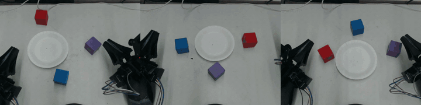
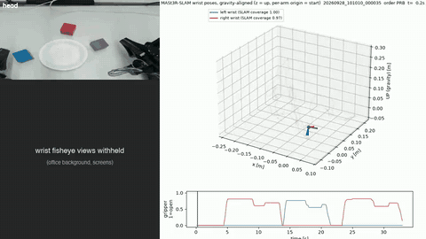
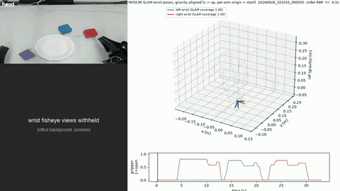
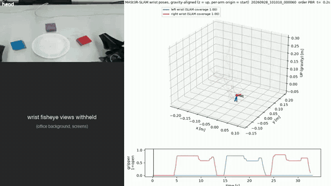
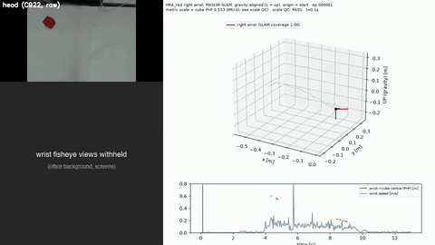
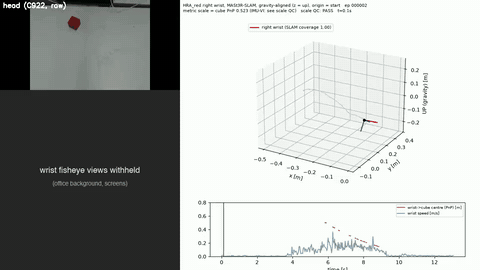
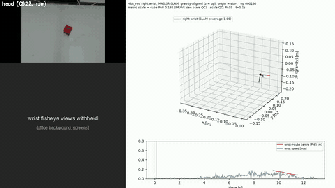
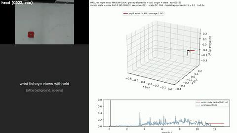

# Egocentric Human Demonstrations for Robot Manipulation

Research code, calibration, processing records and a small data sample from one experiment. We collected bimanual
human demonstrations with a hand-worn UMI-style gripper (HandUMI), converted them into pseudo-joint trajectories
for a reBot B601 dual-arm robot, and used them to pretrain X-VLA. Version 3 (October 2026) replaces the joint-space
retargeting with a Cartesian conversion that matches the robot's own action contract, and tests what transfers to the
robot ([Update v3](#update-v3-cartesian-ego-pretraining-and-transfer)). The earlier state is tagged `report-v2-2026-09-30`.

The write-up is [`report/report.pdf`](report/report.pdf) (LaTeX source `report/report.tex`, figures rebuilt by `report/figures/make_figures.py`).

**Status: offline evaluation and training diagnostics.** Version-3 checkpoints were executed on the robot, but no task
outcome was logged, so this repository reports **no closed-loop success rate**.

## Demonstration videos



Head-camera view of three recorded human demonstrations (2x speed). Left to right: RBP (train), PRB (train),
BPR (held-out validation episode). Full-length videos (640x480, 30 fps, 23 s, no audio):

| Episode | Order (bottom → top) | Split | Video |
|---|---|---|---|
| `20260917_150545_000001` | red, blue, purple | train | [head.mp4](sample_data/20260917_150545_000001/head.mp4) |
| `20260917_150545_000005` | purple, red, blue | train | [head.mp4](sample_data/20260917_150545_000005/head.mp4) |
| `20260917_150545_000010` | blue, purple, red | held-out | [head.mp4](sample_data/20260917_150545_000010/head.mp4) |

**MASt3R-SLAM wrist trajectories** (v3): head view + gravity-aligned 3D wrist trajectory + gripper or speed trace;
wrist fisheye panels covered for privacy. Details in [MASt3R-SLAM trajectory videos](#mast3r-slam-trajectory-videos).

| Video | Take | Metric scale |
|---|---|---|
| [hrl80_000035.mp4](docs/media/mast3r_trajectories/hrl80_000035.mp4) | HRL80 bimanual stacking, PRB, 33 s | IMU-VI |
| [hrl80_000055.mp4](docs/media/mast3r_trajectories/hrl80_000055.mp4) | HRL80 bimanual stacking, RBP, 33 s | IMU-VI |
| [hrl80_000060.mp4](docs/media/mast3r_trajectories/hrl80_000060.mp4) | HRL80 bimanual stacking, PBR, 33 s | IMU-VI |
| [hra_000001_right.mp4](docs/media/mast3r_trajectories/hra_000001_right.mp4) | HRA_red right-hand approach, 13 s | cube PnP |
| [hra_000002_right.mp4](docs/media/mast3r_trajectories/hra_000002_right.mp4) | HRA_red right-hand approach, 13 s | cube PnP |
| [hra_000150_right.mp4](docs/media/mast3r_trajectories/hra_000150_right.mp4) | HRA_red, scale QC fail (excluded) | cube PnP |
| [hra_000180_right.mp4](docs/media/mast3r_trajectories/hra_000180_right.mp4) | HRA_red right-hand approach, 13 s | cube PnP |

These are human demonstrations recorded with the hand-worn rig, not robot rollouts. Wrist-camera videos are not
published (see [Sample data](#sample-data)).

## Dataset

- **Task:** stacking three cubes (red, blue, purple) on a plate, in 6 stacking orders (RBP, RPB, BRP, BPR, PRB, PBR).
  The instruction text is `Stack the {bottom} cube on the bottom, {middle} cube in the middle, and {top} cube on the top, on the plate.`
- **Rig:** each hand wears a HandUMI unit with a wrist fisheye camera (1080p, 30 fps), a Teensy IMU (200 Hz) and a
  Feetech jaw encoder. A fixed C922 head camera (640x480, 30 fps) looks down at the table.
- **Processing funnel:**
  - 349 recorded episodes
  - 284 pass sync (left wrist is the master clock; the right wrist and head must be within 20 ms)
  - 259 source episodes remain after pose, gripper and gate filtering
  - 561 bimanual segments of 65 frames each
- **Pose:** MASt3R-SLAM gives the RGB-only wrist-camera pose. Metric scale comes from a per-episode IMU visual-inertial
  fit (`cp6_scale.imu_vi`). On a separate 14-episode ArUco benchmark (10 tracks held out) the scale error is
  4.6 / 17.0 % (p50 / p90) and the 16-step relative position error p90 is 11.3 mm (`results/pose_benchmark/`). The camera-to-TCP transform is `handumi_camera_tcp_v2`.
- **Retargeting:** trajectories are anchored at the robot start pose and retargeted to reBot B601 pseudo-joints with
  continuity IK. Segments then pass workspace, metric, IK/FK and inter-arm collision gates. Sessions with inconsistent
  IMU and camera rotation are quarantined (`results/c8_quarantine.json`).
- **Split:** by source episode, never by segment. `numpy.random.default_rng(0)` gives 233 train episodes (504 segments)
  and 26 held-out episodes (57 segments). See `results/split_index.json`.
- **Model:** X-VLA (879M parameters), initialised from `lerobot/xvla-base`, pretrained for 300k steps on the ego set. Loss terms:
  - Main target: a Δq_pseudo action chunk, `q[t+5+i] - q[t]` for i = 0..29 (LEAD 5, 30 steps). It is defined in `training/humanik_delta.py`.
  - EEF auxiliary loss on relative TCP xyz (`XVLA_EE_AUX`).
  - FK-consistency loss.
- **Evaluation:** offline, on the 26 held-out episodes. Metrics are joint MAE against a zero-action baseline, FK
  position error, direction cosine and a collapse ratio. The checkpoint selection rule was registered before any
  results (`geo_score`); a second, motion-gated selector was added post hoc and is labelled as such
  (`results/selection.json`).

The held-out set is a random 10% of source episodes. It is not balanced by order or by session, and the cube layouts
were not systematically randomised. None of the results here are claims about generalisation.

## Key results (offline, 26 held-out episodes, final 300k checkpoint)

| | all arm-samples (798) | moving, TCP ≥ 20 mm by k=30 (187) |
|---|---|---|
| median TCP error, k=1 / k=30 | 1.5 / 5.7 mm | 11.2 / 39.9 mm |
| joint MAE k=30 (zero-motion predictor) | 0.97° (0.51°) | 6.59° (8.68°) |
| TCP direction cosine, k=30 | 0.81 | 0.90 |

- Aggregate errors are dominated by static phases; on static samples the policy predicts spurious motion.
- Prompt swap: the 6 order instructions move the k=30 prediction by 4.8 mm (≈8 % of the 62 mm predicted displacement),
  and the true instruction is no closer to the recorded motion than a wrong one (mean rank 3.55 of 6, chance 3.5).
  The instruction measurably changes predictions but does not make them more accurate.

## Update v2: multi-seed retargeting, robot-like collection, combined dataset

The first release used a single-anchor retarget ("v1"). Every segment started from one robot posture, so v1 lost
most segments at the workspace gate and collapsed the pseudo-joint starts onto one posture. v2 changes the retargeting
and adds a second, robot-like collection. Nothing in the first-release dataset was modified.

**Status: offline only.** The v2 ego pretrain on the 996-segment dataset was stopped by us at 211.7k of 300k planned
steps; the 100k (primary) and 200k checkpoints are kept (`results/finetune/C_OLD_TR_HANDOFF.json`). No robot
fine-tuning result from them is reported. The fine-tuning comparison below uses the **v1** ego pretrain.

### Retarget v2 under an R30-only contract

Every quantity taken from real robot data (seed-bank bounds, workspace gate, manifold penalty, TR window library) comes
from 30 robot episodes (R30) only. R30 is part of every later fine-tuning subset. Evaluation uses the remaining 120
robot episodes (held-out R120). Results on the old 259 source episodes (1,229 candidate segments):

| method | usable | posture NN to held-out R120, p50 / p90 (rad) | W1 \|dq\| vs held-out |
|---|---|---|---|
| v1 single anchor | 36.5 % | 1.494 / 1.551 | 0.00197 |
| v2-K kinematic multi-seed | 66.6 % | 1.206 / 1.599 | 0.00275 |
| v2-Kr + manifold penalty | 67.0 % | 0.441 / 0.738 | 0.0031 |
| v2-TR R30 window retrieval | 56.1 % | 0.272 / 0.454 | 0.00208 |

- TR is the primary method. It gives the closest postures but fails more segments; almost all of its failures are
  `no_workspace_window`.
- On the 686 segments that both TR and Kr solve, TR's velocity W1 advantage is small (0.00207 vs 0.00226). Most of the
  dynamics gap in the table comes from which segments each method keeps. The posture gain holds on the matched set.
- The hybrid master (TR if feasible, else Kr) was frozen before HRL80 was retargeted. The primary pretrain set uses TR
  segments only; hybrid-all is kept as an ablation.

Code: `pipeline/retarget_v2/`. Frozen contracts: `pipeline/retarget_v2/contracts/`. Results: `results/retarget_v2/`.

### Robot-like collection (protocol `robot_like_v1`, dataset HRL80)

The protocol runs inside the existing collector (`--protocol robot_like_v1`). It uses 30 s AUTO episodes and a live
panel of wrist rotation speed and acceleration against reBot R150 p95 levels, and tracks grasp stages. After each
session, an offline MASt3R → IK robot-feasibility check runs. Without the flag, the collector behaves exactly as in the
first release.

- HRL80 = 60 episodes, 10 per order, in one session on 2026-09-28 with one operator. The target was 14 per order.
- Retargeted with the same frozen pipeline: TR 58.9 % (old259: 56.1 %), Kr fallback 15.5 % (11.2 %), none 25.5 %
  (32.7 %); hybrid usable 74.5 % (67.3 %).
- HRL80 wrist rotation speed was lower than old259's (median over-p95 fraction 0.067 vs 0.144), but per-episode
  TR feasibility did not change (0.59 vs 0.592). The live metric does not track feasibility: Spearman ρ −0.10 old259,
  −0.17 HRL80, −0.11 pooled. The pre-registered reading that fits is "live up, offline flat". The workspace remains the
  main failure. The two groups differ in session and scene as well as protocol, so any difference is only associated
  with the protocol, not shown to be caused by it. We read this as a negative, diagnostic result: collection style is
  not what limits retarget yield.

Code: `collection/handumi_collector/robotlike/`, `collection/scripts/robotlike_*`, `collection/configs/handumi/robot_like_v1.yaml`,
`collection/docs/ROBOT_LIKE_PROTOCOL.md`. Results: `results/hrl80/`.

### C-old v2 dataset (final, frozen)

- 996 TR segments of 65 frames each: old 689 plus HRL80 307.
- Split: train 896 / val 100, taken by source episode (284 / 32).
- Chunk starts: 27,776 train / 3,100 val.
- Val = the first release's 26 held-out episodes + HRL80 episodes 49–54, one round of all six orders. Report these two
  val groups separately.
- The old segments are appended unchanged. Rows, task strings and every decoded video frame are verified identical to
  the frozen old259 snapshot (invariants I0–I5).

Builders and validators: `pipeline/dataset_v2/`. Metadata and manifests (no video or parquet data): `results/dataset_v2/`.

### Ego pretrain → robot fine-tuning (v1 ego pretrain)

At 250k steps of R150 fine-tuning, the model initialised from the v1 ego pretrain beats scratch (`lerobot/xvla-base`,
same recipe) by a small margin on most metrics:

| metric | geo | motion geo | k30 FK p50 | motion k30 MAE |
|---|---|---|---|---|
| C-old vs scratch | −10.0 % | −7.2 % | −4.1 % | −6.8 % |

- Episode-level paired bootstrap (10k draws, `analysis/paired_bootstrap_r150.py`): geo 95 % CI −14.7 to −5.6 %,
  motion geo −13.4 to −1.8 %, motion k30 MAE −12.7 to +0.5 %; 8 of 10 episodes favour the ego init.
- Episodes 66/77, motion geo: C-old is worse (+4.2 %).
- **All 10 evaluation episodes are in the R150 fine-tuning data of both arms.** This comparison measures fit to seen
  episodes, not generalisation.
- R90 was stopped early and compared at only 2 matched steps (10k, 20k). Signs are mixed: C-old is better on all-sample
  geo (−33 %, −11 %) and worse on motion geo (+2 %, +13 %). There is no conclusion. R60 (scratch arm only) and R30
  (≤ 20k steps) were also stopped; `results/finetune/RUN_STATUS.json` lists every run's final state. None is running.

Records: `results/finetune/`. The v2 pretrain launch record is `results/finetune/FINAL_TR300K_LAUNCH.json`.

### Repository map additions

| dir | contents |
|---|---|
| `pipeline/retarget_v2/` | seed bank, v2-K / v2-Kr / v2-TR retarget, held-out comparison, hybrid merge, HRL80 prereg report, chain scripts; `contracts/` = frozen rules, R30 list, splits, prereg, gripper contract, seed banks |
| `pipeline/dataset_v2/` | TR / hybrid / HRL80 LeRobot builders, final append, validators, append-invariant checker, env-driven `write_stage.py` |
| `collection/…/robotlike/`, `collection/scripts/`, `collection/tests/`, `collection/docs/` | robot-like protocol monitor, offline check and group comparison, tests, protocol doc |
| `results/retarget_v2/`, `results/hrl80/`, `results/dataset_v2/`, `results/finetune/` | comparison JSONs, frozen master manifests, HRL80 census and prereg report, dataset manifests and gates, fine-tuning evals and summaries |
| `docs/NUMBERS_v2.md`, `docs/SOURCES_v2.md`, `docs/FINAL_CLAIMS.md` | every v2 number with its file and key; source mapping; headline claim table with evidence and status |

## Update v3: Cartesian ego pretraining and transfer

Retargeting to robot joints removed a third to a half of the human motion and produced a joint-space target that our robot
policies are not trained in. Version 3 converts whole human episodes directly into the robot's own relative-Cartesian
action contract, then tests what transfers. Report sections X–XIII. Run status for every v3 run:
`results/v3/RUN_STATUS_v3.json`.

**Status:** training diagnostics only. Checkpoints were executed on the robot (`results/v3/hardware_cycles_by_ckpt.csv`:
71 checkpoints, 49,431 control cycles), but the log records IK tracking, not task outcome, so there is no success rate.

### Data contract and dataset (`cart20/`)

- Rows at 15 Hz. Action = 16 future poses `inv(T(t)) @ T(t + k·50.05 ms)`, k = 1..16 (0.80 s), interpolated on the raw
  30 Hz track. Per arm xyz + 6-D rotation + gripper = CART20; the model's 32-D action is padded with 12 exact zeros.
- State = each arm's pose relative to its task start + both grippers (same layout as the robot data). Gripper =
  continuous aperture / 80 mm (max observed 0.847).
- No workspace or IK filtering. 330 episodes (273 original + 57 HRL80; 3 refused for invalid IMU scale).
  111,533 rows at 15 Hz, of which 57,283 (51.4 %) are trainable.
- Frozen split: train 298 episodes / 51,612 rows, val 32 / 5,671.
- **Silent pose jumps.** 57 % of apparent > 30 mm state jumps (1,482 / 2,598) were time gaps between exported rows. The rest
  are MASt3R-SLAM translation jumps without a tracking-lost flag (55 raw steps > 3 m/s in 24 training episodes). The v2b filter
  acts on 44 events in 42 episodes → **train 297 / 48,411 rows (−6.20 %)**, val unchanged; max adjacent step 422.5 → 90.5 mm.
- Contract tests: `cart20/tests/test_contract.py` (11 tests, all pass).

Evidence: `results/v3/ego_cart20/`, `results/v3/state_jump/`.

### MASt3R-SLAM trajectory videos

Gravity-aligned wrist trajectories from MASt3R-SLAM (z up, each arm's origin at its start, current tool axes drawn), with
the head-camera view and the gripper (HRL80) or wrist-speed and PnP wrist-to-cube distance (HRA_red) trace. Metric scale:
IMU visual–inertial for HRL80, cube PnP for HRA_red. The wrist fisheye panels are covered: they show the office background
and monitor screens (`analysis/v3/mask_wrist_panels.sh`). Click a preview for the full-resolution MP4.

<table>
<tr><td align="center" width="50%"><a href="docs/media/mast3r_trajectories/hrl80_000035.mp4"></a><br><sub>HRL80 stacking, order PRB (33 s, shown 3×)</sub></td><td align="center" width="50%"><a href="docs/media/mast3r_trajectories/hrl80_000055.mp4"></a><br><sub>HRL80 stacking, order RBP (33 s, shown 3×)</sub></td></tr>
<tr><td align="center" width="50%"><a href="docs/media/mast3r_trajectories/hrl80_000060.mp4"></a><br><sub>HRL80 stacking, order PBR (33 s, shown 3×)</sub></td><td align="center" width="50%"><a href="docs/media/mast3r_trajectories/hra_000001_right.mp4"></a><br><sub>HRA_red right-hand approach (13 s, shown 1.5×)</sub></td></tr>
<tr><td align="center" width="50%"><a href="docs/media/mast3r_trajectories/hra_000002_right.mp4"></a><br><sub>HRA_red right-hand approach</sub></td><td align="center" width="50%"><a href="docs/media/mast3r_trajectories/hra_000180_right.mp4"></a><br><sub>HRA_red right-hand approach</sub></td></tr>
<tr><td align="center" width="50%"><a href="docs/media/mast3r_trajectories/hra_000150_right.mp4"></a><br><sub>HRA_red, scale QC <b>fail</b> (spread 0.11), excluded from the dataset</sub></td><td></td></tr>
</table>

Renderers: `analysis/v3/viz_mast3r_episode.py` (bimanual) and `analysis/v3/viz_hra_mast3r.py` (HRA_red).

### Ego vs robot, and the soft-prompt audit

- Robot IK reaches 99.7 / 99.5 % of ego positions (L / R) and 72.3 / 74.6 % of full ego poses. The deployed IK
  (one wrist joint locked) reproduces only 45.2 / 52.2 % of the robot's **own** poses.
- Wrist-image sharpness (Laplacian variance, p50): ego 1,854 / 1,487 vs robot 59 / 64
  (`results/v3/robotized/wrist_sharpness_val.json`).
- **X-VLA soft-prompt slots:** only slots 10–17 of `lerobot/xvla-base` were ever trained. Ids 0 and 6, both used by our
  earlier runs, were untrained. Initial loss on R312c: slot 0 1.11, 6 1.12, 15 1.61, 10 2.35, 16 2.65, 17 4.07, 11 22.80.
  All v3 runs use unused slot 20. Evidence: `results/v3/domain_slots/`.

### Transfer diagnostics

| test | result | evidence |
|---|---|---|
| Ego-only 40k on 120 robot frames, k8 direction cosine (L / R) | −0.05 / −0.03 (robot-trained 40k: +0.81 / +0.77, in-training frames) | `results/v3/diagnostics/direction_cosine_ego40k_vs_robot40k.txt` |
| Same, best of 12 L↔R swap × axis-flip variants | max +0.16 (not a convention error) | `…/direction_cosine_flip_swap.txt` |
| Image/state swap: ego images + any state | 0.69–0.90 | `…/image_state_ablation_ego40k.txt` |
| Image/state swap: robot images + any state | −0.25 to +0.49 → the gap is visual | same |
| Ego init (50k) vs scratch, R312c fine-tuning loss, identical data/schedule/seed | step 200: 0.244 vs 0.945; B/A 0.49 (0–5k), 0.875 (5–20k), 0.95 (20–40k), 0.984 (55–60k, tie) | `analysis/out/v3_ego_init_loss.json`, `results/v3/loss_curves/` |

- The diagnostic outputs were captured from the session log (the runs wrote no file); each text file says so and names the
  script in `analysis/v3/`.
- The loss comparison is training loss with one seed per arm. The two finished 300k runs used **different robot datasets**
  (R312c vs R384), so they are not a transfer comparison.
- **Robotized wrist** (`cart20/ego_cart20/scripts/export_lerobot_robotized.py`): fisheye → virtual pinhole (hfov 62–70°,
  jaws low), blur, JPEG. ROBOT100 (all frames) sharpness 181 / 132, still 2–3× the robot. The MIX70 pretrain was stopped at 5k.
  Co-training (4 ego + 4 robot per batch, `training/relonly/train_cotrain.py`) was stopped at 88.6k without evaluation. The
  ROBOT100 300k pretrain is running (74k), then R30 fine-tuning. **No result yet.**

### HRA_red: right-hand approach with cube-based scale

- 200 right-hand takes of "approach the red cube". The IMU visual–inertial scale is unobservable on these slow motions: median
  0.012, ≤ 0 in 95 of 200 episodes.
- **Cube PnP scale** (`cart20/ego_cart20/cube_pnp.py`, edge 3.8 cm). Validated on HRL80 takes, where the IMU is reliable:
  37 / 57 valid, PnP/IMU median 1.062 (p16–p84 0.959–1.274).
- Funnel 200 → 181 (scale gates) → 166 (physical sanity). Train 151 episodes / 20,319 rows; val 15 / 2,011.
- Loss-masked training (left arm and gripper masked; 9 / 20 dims supervised; `training/relonly/rel16_relonly_lossmask.py`).
  The run is at 100k / 300k.
- Held-out loss at 15k: 0.150 vs train-subset 0.066. A partial 30k evaluation (one seed) gives 0.198, a possible overfit.
- No offline direction probe has been run, and robot runs (8,397 cycles) logged no outcome.

Evidence: `results/v3/hra_red/`.

### Repository map additions (v3)

| dir | contents |
|---|---|
| `cart20/` | Cartesian ego package: contract (`config.py`), geometry, interpolation, jump filter, label builders, converter, validators, LeRobot exporters (plain, robotized-wrist, right-only), cube PnP scale, right-only conversion + sanity gate, ego-vs-robot and IK compatibility reports; `tests/` (contract, cube scale, right-only) |
| `training/relonly/` | REL-only loss plugin (dims 20:32 zeroed), per-dim loss-mask variant + tests, AdamW8bit wrapper with a checkpoint-save shim, exact 4 + 4 ego/robot co-training sampler |
| `analysis/v3/` | loss-curve extraction and the matched init comparison, direction-cosine and image/state-swap diagnostics, wrist optical-flow axis check, soft-prompt slot audit + init-loss probe, wrist sharpness, HRL80 PnP-vs-IMU validation, HRA held-out loss, hardware cycle counts |
| `results/v3/` | dataset metadata and integrity reports, jump root cause, ego-vs-robot statistics, slot audit, robotized export records, loss curves, diagnostics, HRA QC (per-episode scale records), run status |
| `report/figures/make_figures_v3.py` | Figs. 4–5 of the report |

v3 code imports some internal packages that are not included: the HandUMI raw-episode exporter (`sources/handumi_export.py`),
the deployment/inference client (`infer_core_v4`) used by the diagnostics, and the robot datasets. Raw HRA videos and wrist frames are not published. The trajectory videos above keep only the head view (checked on 12
frames per video: table, cube, operator's gloved hand), the 3D trajectory and the plots.

## Repository map

| dir | contents |
|---|---|
| `collection/` | HandUMI collector (`handumi_collector/`: devices, recorder, session/auto-loop, PySide6 UI, calibration and QA tools) and `configs/handumi/{tasks,hardware_handumi_v1}.yaml` |
| `calibration/` | Calibrations used for this dataset: fisheye intrinsics (L v002, R v003), camera-IMU extrinsics (L v001, R v002, plus the Kalibr result files in `kalibr/`), head C922 intrinsics v003, `camera_tcp/handumi_camera_tcp_v2.yaml`, the TCP convention and the gripper tick calibrations that the episodes reference (`gripper/`) |
| `pipeline/export/` | Episode export to the raw_video + imu_data layout (`umi_export_orbslam.py`, `c8_export*.sh`) |
| `pipeline/mast3r_pose/` | Per-frame MASt3R-SLAM wrapper (`run_perframe*.py`), the sm_120 build patch, the pinned upstream commit and checkpoint MD5s, run scripts, and IMU-VI metric scale (`cp6_scale.py`) |
| `pipeline/grip/` | Gripper width from raw jaw ticks (aperture 0.0675 m): `extract_grip.py`, `correct_grip.py`, `c8_grip.py` |
| `pipeline/census/` | Census and gates: `c8_census_pre.py` (sensor/sync), `c8_phase3.py` (pose -> metric TCP -> pseudo-q, 65-frame segments), collision, gravity-sign and regression checks |
| `pipeline/pseudo_joint/` | Retarget + continuity IK core (`pseudo_joint_pipeline.py`), state layout, input-quality gate, IK wrapper `eef_kin.py` |
| `pipeline/dataset/` | Segment rows -> LeRobot v3 dataset (`c8old_build_dataset.py`, `write_stage.py`), post-build and gripper-semantics gates |
| `training/` | `train_bi.py` (LeRobot X-VLA entry point with install hooks), `humanik_delta.py` (Δq target, EEF aux and FK losses), `c8old_chain.sh` (smoke -> 300k pretrain -> integrity -> robot fine-tune), `c8old_launch.sh`, and `robot/` (reBot URDF, numpy/torch FK) |
| `evaluation/` | Offline checkpoint evaluator (`c8old_mac_eval.py`), frame cache and checkpoint selection |
| `results/` | `episode_manifest.csv` (349 episodes: session, order, time, domain, funnel outcome, split), `model_config/` (X-VLA `config.json`, `train_config.json`), `pose_benchmark/`, census/funnel JSONs, domain manifest, quarantine list, gripper census, split index, run provenance/summary, per-checkpoint eval JSONs (`eval/`, `eval_gated/`) and `selection.json` |
| `sample_data/` | 3 episodes (see below) |
| `analysis/` | `verify_claims.py` recomputes every number in the report and this README from the files in this repo (see `analysis/out/claim_audit.md` for the count; table in `analysis/out/claim_audit.md`). Post-hoc analyses of the final checkpoint: `prompt_swap.py` (6 order instructions, same noise seed, + 2 extra seeds), `summarize_prompt_swap.py`, `per_order_breakdown.py`; summaries in `analysis/out/*.json` |
| `report/` | Technical report (PDF + LaTeX) and figure script |

## Verifying the numbers

```bash
python3 analysis/verify_claims.py --md analysis/out/claim_audit.md   # needs pyyaml; exits 1 on any mismatch
python3 analysis/paired_bootstrap_r150.py                            # R150 250k episode-level bootstrap
python3 analysis/v3/ego_init_loss_compare.py                         # v3 matched initialization comparison
python3 report/figures/make_figures.py && python3 report/figures/make_figures_v3.py && tectonic report/report.tex
```

## What this repository does not show

- No closed-loop robot success for any egocentric-pretrained policy (v3 checkpoints ran on the robot; outcomes were not logged).
- No held-out or closed-loop comparison of ego-initialized vs scratch v3 models; the matched comparison is training loss to 60k.
- No transfer of the ego-only policy, or of the robotized wrist images, to robot cameras.
- No generalization to unseen cube layouts (layouts were not recorded) or to unseen stacking orders (all six are in training).
- No benefit on disjoint robot test data: the 10 % R150 gain is measured on episodes inside both fine-tuning sets.
- No transfer to other operators or scenes (one operator, one scene).

## Not included

- `training/robot/reBot_B601_DM_dualarm.urdf` (vendor robot model) and `pipeline/mast3r_pose/build_compat_5090.patch`
  (a diff against MASt3R-SLAM) are withheld until their licences are confirmed. The FK code in `training/robot/`
  expects the URDF at that path.

## Running it

This is research code from a single lab environment. Absolute hostnames, IPs, user names and home paths have
been replaced with placeholders: `${HOME}`, `${REMOTE_HOME}`, `${DATA_ROOT}`, `${SHARED_ROOT}`, `<gpu-node>`,
`<ray-head>`. Many scripts still assume the original directory layout (`~/c8`, `~/umi_bridge`, `~/ego_collector`).
Where each part ran:

- **Collection:** macOS laptop (PySide6, AVFoundation/UVC, `uvc-util`). Entry point `python -m handumi_collector.collect`, run from `collection/`.
- **Export, gripper, census, dataset build, offline eval:** CPU / Apple MPS.
- **MASt3R-SLAM:** one RTX 5080 (16 GB), with the upstream repo patched by `build_compat_5090.patch`.
- **Training:** one RTX 4090, submitted as a Ray job, fp32 with TF32 matmuls, batch 4.

Upstream dependencies (not vendored):

- LeRobot with X-VLA: <https://github.com/huggingface/lerobot>. The base weights are `lerobot/xvla-base` on the Hugging Face Hub.
- MASt3R-SLAM: <https://github.com/rmurai0610/MASt3R-SLAM>. The pinned commit is in `pipeline/mast3r_pose/INSTALLED_COMMIT` and the checkpoint MD5s are in `MD5SUMS`.
- Universal Manipulation Interface (`umi.common.pose_util`): <https://github.com/real-stanford/universal_manipulation_interface>
- Python packages: `mcap`, `numpy`, `scipy`, `opencv-python`, `av`, `pandas`, `pyarrow`, `torch`, `pyyaml`, `PySide6`, `pyserial`, `scservo_sdk` (Feetech).

Not included (these live in other internal packages):

- `ego_collector.camera.capture` / `orbbec_capture`: the camera capture backend imported by `collection/.../devices/camera.py`.
- `handumi_collector.tools.pose_process`, `pose.run` and `pose.backends`: the legacy offline VO pipeline. `tools/camera_imu_offset.py` imports `pose_process.episodes_under`.
- `handumi.robots` (the `rebot_b601` embodiment and IK solver): imported by `pipeline/pseudo_joint/eef_kin.py`.
- `umi_bridge/track_c/data/r150_q_tcp.npz`, the robot reference joint/TCP data used by `c8_phase3.py`, and the R150 robot dataset used by the fine-tune stage of `c8old_chain.sh`.
- The legacy gripper anchor file `gripper_contract.json` read by `c8_grip.py`. `pipeline/grip/correct_grip.py` gives the rule it was derived from (aperture 0.0675 m).
- `umi_export_orbslam.py` expects `handumi_collector` and `configs/calibration` as siblings of its parent directory. In this repo they are `collection/handumi_collector` and `calibration/`.
- `train_bi.py` imports `eef_delta.py` unconditionally. A copy is included, but it stays inactive unless `EEF_DELTA=1`, which the chain never sets.

## Sample data

`sample_data/<session>_<episode>/` holds three episodes from session `Hpilot_20260917_150545`:

| id | order | split |
|---|---|---|
| `20260917_150545_000010` | BPR | held-out (val) |
| `20260917_150545_000001` | RBP | train |
| `20260917_150545_000005` | PRB | train |

Each episode directory contains:

- `episode_meta.json`, `events.json`
- `sensors.mcap`: IMU, gripper, per-frame camera metadata and sync events
- `head.mp4`: head camera, re-muxed video-only
- `derived/pose_mast3r_filtered/`: per-side camera/TCP pose parquet files, canonical table and pose QA
- `segments_<id>.npz`: the processed 65-frame segments. Keys are `starts, st, ac, tcp_tgt, vfL, vfR, vfH, epd, instr, val`. `epd` is the episode path relative to the raw dataset root (`Hpilot/<session>/<episode>`).
- `right_wrist_frame.jpg`: one 640 px frame from the right wrist camera. It was checked by eye to show only the tabletop, cubes, plate and HandUMI hardware.

**The wrist fisheye videos (`left_wrist.mp4`, `right_wrist.mp4`) are not included.** Their wide field of view
captures bystanders and office monitor screens. No left-wrist frame is included because every candidate we looked at
showed the office background or the operator's arm.
